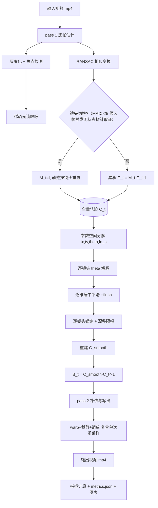

# 架构设计

> 对应 AGENTS.md §6（目录与接口契约）、§7（数学约定）、§8（自研方案）。

## 一、总体架构：两遍离线流水线

为什么是两遍：参数空间平滑需要**全量轨迹**（居中平滑需未来帧、稳定度指标需整段、裁剪需全片有效域交集），而单遍在线无法提供；又因 test1.mp4 全帧缓存约 5.3 GB，**pass 2 采用重读文件**而非缓存全帧。



ASCII 回退视图：

```
[输入] ──pass1──> M_t ──累积──> C_t ──分解──> 参数曲线
                                              │
                            逐镜头(解缠→平滑→锚定→限幅)
                                              ↓
[输出] <──pass2── warp(B_t)+crop+resize <── B_t <── C_smooth
                                              │
                                       指标/图表/metrics.json
```

## 二、模块职责与依赖

| 模块 | 职责 | 依赖 |
|---|---|---|
| `src/io_utils.py` | 视频读写封装、一致性检查、退出码常量与异常类 | cv2（仅读写） |
| `src/features.py` | 自研 Harris 角点（M1） | NumPy |
| `src/tracking.py` | 自研单层 LK 光流（M1） | NumPy、features（梯度） |
| `src/motion.py` | 自研 RANSAC 相似变换估计 | NumPy |
| `src/shots.py` | 镜头切换检测与分段（v2.1 判据 + v2.3 无状态探针取证） | NumPy、cv2（仅灰度转换）、`features`/`tracking`/`motion`（探针单步取证，无循环依赖） |
| `src/trajectory.py` | 全量轨迹缓冲、参数分解/重建、漂移限幅、镜头重置 | NumPy |
| `src/smoothing.py` | 三平滑器（居中 + flush + 部分窗口重归一） | NumPy、`ds/` |
| `src/warp.py` | 逆向映射 + 双线性插值（`warp_frame` / `resample`） | NumPy |
| `src/crop.py` | 解析法有效域、裁剪框、复合重采样 | NumPy、`warp.resample` |
| `src/metrics.py` | ITF / 裁剪率 / 失真值 / 稳定度（逐镜头聚合） | NumPy、cv2（仅灰度转换） |
| `src/visualize.py` | 轨迹对比图、指标柱状图 | matplotlib |
| `ds/ring_buffer.py` | 手写环形缓冲（定长数组 + 头尾指针） | — |
| `ds/heap.py` | 手写二叉堆（上浮/下沉，最大/最小） | — |

## 三、数学约定（§7）

| 符号 | 含义 |
|---|---|
| $M_t$（t=1..N−1） | 第 t−1 帧 → 第 t 帧的相似变换，$p_t = M_t p_{t-1}$ |
| $C_t$ | 累积轨迹，$C_t = M_t C_{t-1}$，$C_0 = I$ |
| 参数空间 | 每帧分解为 $(t_x, t_y, \theta, \ln s)$ 四条累积曲线（$\ln s$ 使尺度可加） |
| $\theta$ 解缠 | 平滑前 `np.unwrap`（逐镜头执行），重建用 cos/sin 天然回主值 |
| 平滑 | 四条曲线**逐维**居中平滑 |
| 锚定 | 平滑结果减去本镜头首点常数偏移（$\Delta^2$ 能量不变，保证 $B_0=I$） |
| 限幅 | $\delta = p^{smooth}-p^{raw}$ 逐维截断（默认 30 px / 3° / 0.05） |
| $B_t$ | 补偿矩阵 $B_t = C_t^{smooth} C_t^{-1}$，$B_0 = I$ |
| warp | `warp_frame(img, M)`：M 为输入→输出正向，内部求逆采样 $out(x)=img(M^{-1}x)$ |

**为什么选相似变换而非全仿射**：剪切分量不对应手持抖动，且无法干净分解到参数空间做逐维平滑（§2）。局限：不含透视/视差，报告需写明。

## 四、镜头切分（方案①，v2.1）

多镜头剪辑素材若按单镜头假设累积全局轨迹，切换处会污染轨迹 → 平滑滞后 → 补偿偏差触及限幅 → 全片有效域交集被压缩（实测裁剪率 0.786 < 0.85）。

判据（阈值由 test1.mp4 实测分布确定）：

```
切换 ⟺ 帧间灰度 MAD > 25.0
     且（RANSAC 内点率 < 0.30 或 跟踪存活比例 < 0.25 或 探针存活比例 < 0.25）
     且 距上次切换 ≥ 12 帧
```

- MAD 单条件会把快速甩镜误判为切换；
- 「内点率崩塌」= 运动无法被单个相似变换解释；
- 「存活率崩溃」是补丁：胶片齿孔/片框等**跨场景静态结构**仍被稳定跟踪，切换帧内点率可达 0.80 而存活率仅 0.099；
- **无状态探针（v2.3）**是第二层补丁：长期跟踪点集会退化为跨场景静态结构（存活 ≥30 永不重检测），到切换帧时存活率仅 ~0.55、内点率 0.8+，上述两线均无法触发（508/809/880 漏判根因）；故 MAD 候选帧上由 `probe_cut_evidence`（上一帧现检角点 + 单步跟踪的新鲜全集）独立取证，两路证据**取或**。仅候选帧触发，全片代价可忽略。崩溃线标定（LK 残差 0.05、max_corners=500、test1 实测、取间隔中点）：v2.3 初标 0.45（旧点集：切换帧 0.099–0.237 vs 常态 0.656–1.000）；**v2.5 角点空间均匀化后点集含更多弱角点、常态帧存活率整体下移，重标为 0.25**（切换帧 0.137–0.194 vs 常态 0.294–0.975）。注意：探针线与 LK 残差阈值存在交互（放宽至 0.075 会使切换帧探针存活抬升至 0.402，且实验证明 0.075 损害 ITF，已回退 0.05——见 KNOWN_ISSUES #19）。

命中后：该帧 $M_t = I$、轨迹在该帧重置为新镜头起点、重新检测角点；平滑 / 锚定 / 限幅 / 稳定度均**逐镜头独立**。

## 五、裁剪与重采样

1. **解析法有效域**（不依赖图像内容，夜景/暗场景不误判）：每帧有效域 = 输入矩形经 $B_t$ 作用的旋转矩形；取其**同心最大内接轴对齐矩形**闭式解。
2. **全片有效域** = 逐帧内接矩形的轴对齐交集（保守：先内接再求交，复杂度 O(N)，差异与复杂度分析写入报告）。
3. **裁剪框向内取整**（ceil L/T、floor R/B）保证输出无黑边。
4. **复合单次重采样**：补偿 warp + 裁剪 + 缩放合成为一次 `resample`（提速约 1.8×，且避免二次插值模糊）。
5. 裁剪率 < 0.85 时**只报告数据、不擅自放大裁剪或降低标准**（§8.6）。

## 六、异常降级与退出码（§12）

| 触发条件 | 处理 | 退出码 |
|---|---|---|
| 视频打不开 / 帧读取失败 | 明确报错 | 1 |
| 某帧角点数 < 20 | 降阈值重检一次；仍不足则 $M_t=I$ 并 warning | — |
| RANSAC 内点 < 6 | 沿用 $M_{t-1}$ 并 warning | — |
| 连续 ≥ 5 帧失败 | 终止并报告 | 2 |
| 跟踪存活 < 30 | 下一帧重新检测角点 | — |
| 镜头切换 | $M_t=I$ + 轨迹按镜头重置 | — |
| 输出封装不一致 | 报错（尺寸需为偶数、帧尺寸须匹配） | 3 |
| 内部异常 | 记录堆栈 | 4 |

非零退出时：不产出 metrics.json；已部分写盘的输出删除并报告（删除失败则保留并报告路径）。

## 七、性能相关实现选择

| 选择 | 效果 |
|---|---|
| 输出网格缓存（按输出尺寸缓存一次） | 避免逐帧重建百万级坐标数组 |
| uint8 走 float32 计算 | 重采样提速约 1× （内存带宽减半） |
| warp+裁剪+缩放复合 | 提速约 1.8×，画质更锐（少一次插值） |
| pass 2 重读文件 | 避免约 5.3 GB 全帧缓存 |

实测：test1.mp4（1440 帧，1280×976）pass 1 ≈ 98 s、pass 2 ≈ 1055 s（全自研特征/光流；v2.5 角点空间均匀化后 §12「存活 <30 重检测」增至 47 次，pass 2 warp 随之增加）。
